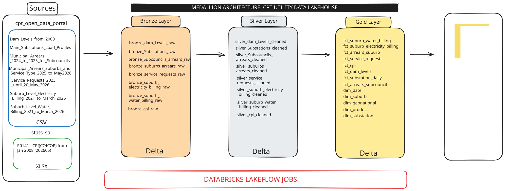
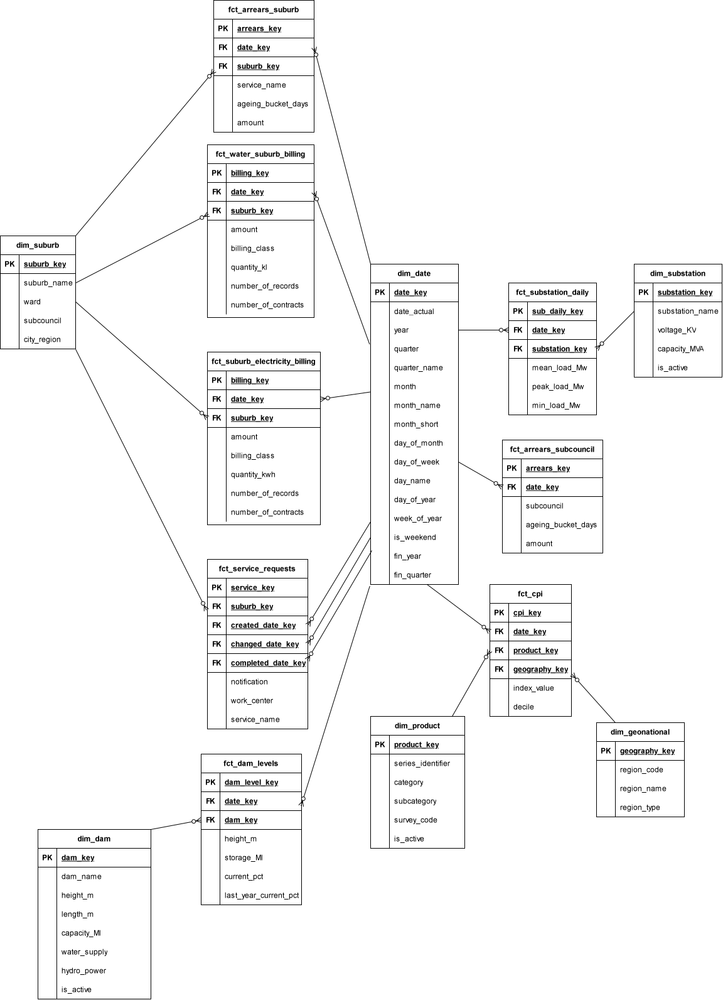

# cpt-utility 

### 📖 Extended Project Documentation
For full development logs, column-level data dictionaries, and architectural decision records (ADRs), explore the [CPT Utility Project Notion Workspace](https://app.notion.com/p/CPT-UTILITY-39203e73955680c18144db3039ccbc10?source=copy_link).

### 🎯 Project Charter

**The Mission**
Support the City of Cape Town’s Open Data Initiative by democratizing access to public municipal datasets, fostering operational transparency, civic innovation, and data-driven economic growth.

**The Architecture**
An end-to-end ELT Medallion Lakehouse pipeline on Databricks that ingests, cleans, and structures public municipal records into:
* **8 Silver Datasets:** Cleaned, deduplicated, and governed via Delta Live Tables (DLT) expectation rules.
* **Gold Galaxy Schema:** 6 enriched, conformed dimensions sharing 8 multi-fact tables tailored for complex municipal metrics.

**The Impact**
Eliminates manual data preparation bottlenecks and removes technical friction for analysts and city stakeholders, delivering high-performance, low-latency DirectQuery reporting in Power BI or Tableu.

### 📂 Ingested Open Data Datasets

**Finance & Revenue Protection**
* **Municipal Arrears by Sub-council** (`2021–2026`) — Sub-council level debt and arrear tracking.
* **Municipal Arrears by Suburb & Service Type** (`2025–2026`) — Granular suburb debt broken down by service category.
* **Suburb-Level Electricity Billing** (`2021–2026`) — Spatial electricity consumption and revenue metrics.
* **Suburb-Level Water Billing** (`2021–2026`) — Spatial water usage and billing records.

**Economics & Macro Inflation**
* **Consumer Price Index (COICOP)** (`2008–2026`) — Macroeconomic CPI benchmark used to normalize historical revenue and arrears against inflation.

**Operations & Service Delivery**
* **Municipal Service Requests** (`2023–2026`) — Citizen C3 service request logging, status, and resolution timelines.

**Grid & Energy Infrastructure**
* **Main Substations Load Profiles** (`2022–2024`) — Electrical substation load telemetry and capacity metrics.

**Water Resources & Climate**
* **Cape Town Dam Levels** (`2000–2026`) — Long-term historical water storage levels and capacity percentages.

### 🏗️ System Architecture

  
  
<em>Figure 1: End-to-End Medallion Lakehouse pipeline from City of Cape Town Open Data landing zone to Power BI or Tableau.</em>

### 📐 Data Model (Galaxy Schema)

  
  
<em>Figure 2: Multi-fact Galaxy Schema consisting of 6 conformed dimensions and 8 fact tables for municipal reporting.</em>

